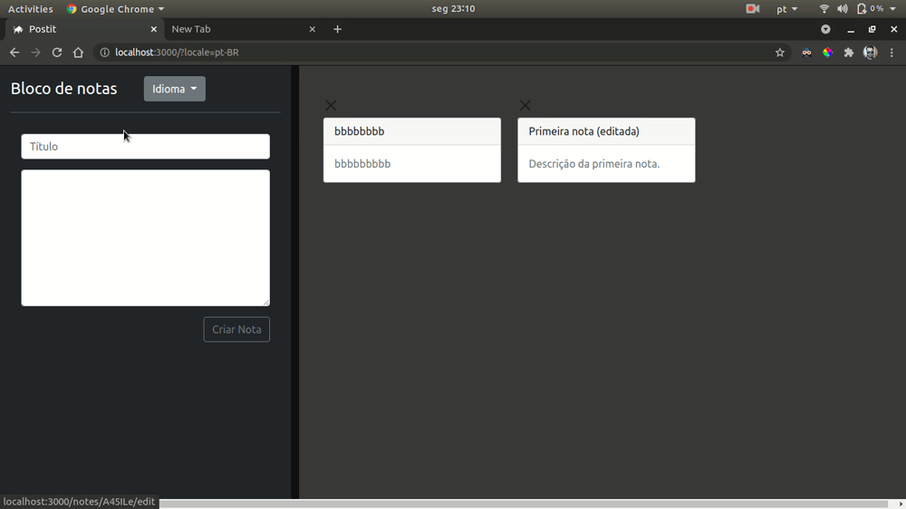

# POSTIT

A simple Ruby on Rails notepad application.
> PRs and issues welcome!



# Getting started
To get started, first clone the repo and `cd` into the directory:

```
$ git clone https://github.com/marcelocd/postit.git
$ cd postit
```

Then install the needed gems (while skipping any gems needed only in production):

```
$ bundle install --without production
```

Install JavaScript dependencies:

```
$ yarn install
```

Next, migrate the database:

```
$ rails db:migrate
```

Finally, run the test suite to verify that everything is working correctly:

```
$ rails test
```

If the test suite passes, you'll be ready to run the app in a local server:
```
$ rails s
```
## Configuration
### Database
The database used in this application is Postgres.
In the `config/database.yml` file you can find the *`ENV['POSTIT_DATABASE_USERNAME']`* and *`ENV['POSTIT_DATABASE_PASSWORD']`* variables being used for authentication.
So verify that you've set the right credentials in your environment for the application to connect with Postgres.

### API
#### Bearer token

This app uses the *`ENV['AUTHORIZED_BEARER_TOKEN']`* variable for API authentication.
So make sure you set the appropriate environment variable (*your .env file, for example*):

```
AUTHORIZED_BEARER_TOKEN = "choose_a_bearer_token"
```
> *Note*: this token chosen is needed for ALL the API requests!

## API usage
The documentation for the API will be available here soon, but here is how you can make requests to it:


#### List notes - GET
```
http://localhost:3000/api/v1/notes
```

#### Read note - GET
```
http://localhost:3000/api/v1/notes/(:id)
```
#### Create note - POST
```
http://localhost:3000/api/v1/notes
```
> *Obs.*: Add the *title* and *body* fields with the desired values to the requet form data.

#### Delete note - DELETE
```
http://localhost:3000/api/v1/notes/(:id)
```

## License

This source code is available under the MIT License and the Beerware License. See [LICENSE.md](LICENSE.md) for details.
